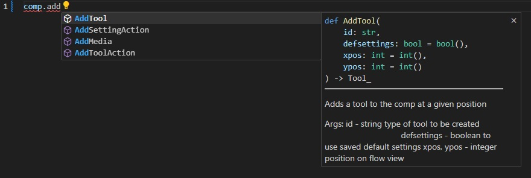

# BMD Fusion scripting stubss

A script to generate python stubs from Fusion.



## Info

If you wish to use this in VSCode I recommend installing my VSCode extension [BMD Fusion scripting](https://marketplace.visualstudio.com/items?itemName=EmberLightVFX.bmd-fusion-scripting)

## Usage

It uses a modified version of Roger Magnusson's Class Browser Extractor script to genenrate the needed json files
Simply run the script and select the json_stubs folder. When the UI opens the files have bin generated.
Now run the stubs_generator script and you'll find all the newly created stubs in the typings folder.

Add the typings folder to your language interpreters extra folder.
In VSCode and Pylance add this string to your settings.json:

```json
"python.analysis.extraPaths": [
    "./fusion_typings"
],
```

The script adds the tool-script objects to __builtins__.pyi so your python files will find these classes without the need to import anything in your python script (that would break the script when ran from Fusion as Fusion already have those classes in the global space)
